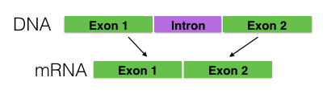

# Transfer across species for splice site prediction problem

During DNA's transcription to mature RNA, the intron is spliced and the exon is included in mRNA. The particular exon of a gene may be included or excluded from the final mRNA. Such process is named alternative splicing, as shown in the following figure, which is crucial for biological mechanism. Alternative splicing , for one thing, makes translate diverse proteins from limited DNA sequence possible. For another, however, 60% of human disease-causing mutations are aroused from alternative splicing [1]. As a result, accurate prediction of splice site based on DNA sequence is of great importance.

Splicing site prediction problem can be regarded as binary classification problem, which discriminates true splice sites from decoy ones given the input DNA sequence. The majority of alternative spicing prediction algorithms are shallow ones, such as Markov Chains, SVM with weighted degree kernel [2], and etc. Recent works attempt to apply deep convolution neural network for splice site prediction [3]. As we know, the motif, the recurrent substring that is conjectured to be have a biological significance, is of importance for splice sited prediction. The one-dimensional convolutional on DNA sequence is intuitive for discovering such k-mers (n-gram) pattern.

In this blog, I will show how to use the deep convolution neural network to predict splice sites. Moreover, I also demonstrate transfer the learnt convolution layers across species. I utilize the splice sites dataset [4] including human, fly, worm, cress, and zebra fish. The label of true sites is imbalance, thereby obstacles learning algorithms. The characteristics of all dataset is shown in the following table.

|  Species   | the number of samples | proportion of true splice sites |
| :--------: | :-------------------: | :-----------------------------: |
|   Human    |      54,627,840       |              0.3%               |
|    Fly     |       2,156,400       |              1.4%               |
|    Worm    |       1,842,750       |              3.6%               |
|   Cress    |       2,234,769       |              3.6%               |
| Zebra Fish |      19,493,947       |              0.7%               |

[1]: https://en.wikipedia.org/wiki/Alternative_splicing	"Wikipedia of alternative splicing"
[2]: http://bmcbioinformatics.biomedcentral.com/articles/10.1186/1471-2105-8-S10-S7	"Sonnenburg, S., Schweikert, G., Philips, P., Behr, J., & Rätsch, G. (2007). Accurate splice site prediction using support vector machines. BMC bioinformatics, 8(10), 1."
[3]: https://arxiv.org/abs/1605.01133	"Lanchantin, J., Singh, R., Lin, Z., & Qi, Y. (2016). Deep motif: Visualizing genomic sequence classifications. arXiv preprint arXiv:1605.01133."
[4]: http://www.raetschlab.org/suppl/splice	"Splice sites dataset"